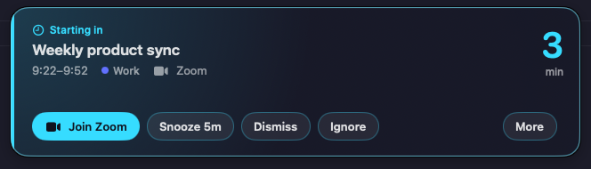

<div align="center">

# MeetAlert

### Unmissable meeting alerts for your Mac.

Desktop popup + phone push + urgent escalation — so "I didn't see the calendar reminder"
stops being an excuse.

[](https://www.apple.com/macos/)
[](https://swift.org)
[](LICENSE)
[](CONTRIBUTING.md)

<br>



</div>

---

## Table of Contents

- [Features](#features)
- [Install](#install)
- [ntfy setup](#ntfy-setup)
- [How it works](#how-it-works)
- [Configuration](#configuration)
- [Filtering / ignoring events](#filtering--ignoring-events)
- [Joining a meeting](#joining-a-meeting)
- [Morning agenda](#morning-agenda)
- [Testing](#testing)
- [Google Calendar (and any other calendar)](#google-calendar-and-any-other-calendar)
- [Support](#support)
- [License](#license)

## Features

- **Multiple alerts per meeting** at whatever offsets you configure — minutes before, at start, or after (a late nag) — not just one.
- **Desktop popup** that stays on screen until you act on it — no auto-dismiss, no silently missed alert — shown on whichever display your mouse is on.
- **Live countdown that changes colour as it gets close** — a large ticking numeral (minutes, then seconds, then how late you are) with the whole card shifting cyan → amber → red, and a pulsing rim once escalation has pinged your phone. State is always spelled out in words and icons too, never colour alone.
- **A colour per calendar** — each alert shows its calendar's name and colour dot, starting from the colour macOS already uses in Calendar.app and overridable per calendar in Settings → Calendars.
- **Keyboard shortcuts on the popup** — click the card once (this never steals focus from the app you're typing in), then `↩`/`J` join · `5` snooze 5m · `1` snooze 1m · `T` until start · `esc` snooze. The two final actions need a modifier on purpose, so ordinary typing can never kill an alert: `⌘D` dismiss, `⌘⇧I` ignore.
- **One-tap Join** — a prominent Join button (and a matching push action) opens the Zoom/Meet/Teams/Webex/Whereby link straight from the alert, and every upcoming meeting with a link is joinable from the menu bar too.
- **Phone push via [ntfy](https://ntfy.sh)** at the same moment, with tappable **ACK**, **Join**, and **Snooze 5m** actions.
- **Away-aware escalation** — idle past a threshold or screen-locked, and the first push already goes out at urgent priority instead of waiting on a grace window nobody at the desk would see.
- **Repeating urgent escalation** — up to 3 re-pushes (never past 15 minutes after the meeting starts) until you ack or snooze, not just one.
- **Morning agenda push** — an optional daily rundown of today's meetings and your largest free gap.
- Reads **every calendar macOS syncs** — Google, iCloud, Exchange, CalDAV — with zero API setup, and skips meetings you've declined. See [below](#google-calendar-and-any-other-calendar).
- **Travel-lead alerts** for meetings with a physical address — one extra early alert to account for getting there.
- Per-calendar checklist, all-day filtering, and keyword-based ignore list.
- Menu-bar countdown to your next meeting (or time left in the one you're in), with the icon itself carrying the state — plain calendar when nothing's close, a clock inside 2 hours, a badged clock inside 3 minutes, a filled clock while a meeting runs, a warning triangle if something needs attention. Starts at login, and re-scans immediately on wake.
- Ad-hoc signed, un-notarized, no analytics, no network calls besides the ntfy push you configure.

## Install

> **Requires macOS 14+ (Sonoma).**

### Homebrew

```bash
brew tap roypadina/tap
brew install --cask meetalert
```

> MeetAlert is ad-hoc signed (not notarized). On first launch, if Gatekeeper complains,
> **right-click it in `/Applications` → Open** (then Open again), or clear quarantine once:
> ```bash
> xattr -dr com.apple.quarantine /Applications/MeetAlert.app
> ```

On first launch macOS will prompt for **Calendar** access — MeetAlert can't see your meetings
without it. It also registers itself to **start at login** automatically, but only on the very
first launch ever — remove it later via **System Settings → General → Login Items &
Extensions** and it stays removed; MeetAlert won't silently re-add it on a later launch. See the
[Installation wiki page](https://github.com/roypadina/MeetAlert/wiki/Installation) if you ever
want it back.

### Build from source

```bash
git clone https://github.com/roypadina/MeetAlert.git
cd MeetAlert
./build.sh
open build/MeetAlert.app
```

`build.sh` runs `swift build -c release` and assembles/ad-hoc-signs `build/MeetAlert.app`.
No Xcode project — it's a plain Swift Package executable.

## ntfy setup

**This is the part that makes escalation actually reach your phone — don't skip it.**

1. Install the **ntfy** app: [App Store](https://apps.apple.com/app/ntfy/id1625396347) (iOS) or
   [Play Store](https://play.google.com/store/apps/details?id=io.heckel.ntfy) (Android).
2. Pick a **private, random topic name** — a long random string, e.g. `meetalert-9f3a1c7b2e`.
   A topic name is effectively a password: on the public `ntfy.sh` server, anyone who knows the
   name can publish to it or read it. Don't use anything guessable.
3. In the ntfy app, **subscribe** to that topic (and leave the server as `ntfy.sh`, unless
   you're [self-hosting](https://docs.ntfy.sh/install/)).
4. Put the same **topic** (and server, if not `ntfy.sh`) into MeetAlert: menu bar icon →
   **Settings…** → **ntfy** section, or edit `~/.config/meetalert/config.json` directly.
   > `ntfyTopic` is **empty by default** — phone push, and escalation with it, stays completely
   > off until you set one. This step is required for anything beyond the desktop popup.
5. In the ntfy app, make sure **urgent (priority 5)** notifications are set up to bypass
   silence/Do Not Disturb — that's the whole point of the escalation. The exact steps differ
   between Android and iOS and are more fiddly than you'd hope; see the
   [ntfy Setup wiki page](https://github.com/roypadina/MeetAlert/wiki/ntfy-Setup) for the
   per-platform walkthrough (short version: Android needs a per-channel "override Do Not
   Disturb" toggle; iOS's Focus-mode bypass is a known ntfy limitation, so also allow the ntfy
   app explicitly under Focus mode settings as a backstop).

Self-hosted ntfy servers work the same way — just set `ntfyServer` to your own instance. **Keep
message caching enabled on the server** (the default) — with `cache-duration: 0`, there's no
message history left to poll, so MeetAlert can never see an ACK/snooze reply and escalates the
full 3 times regardless of whether you actually acked.

## The popup

One instrument, read from across the room: a big monospaced-digit countdown, and a colour that
changes with urgency rather than decoration.

| State | When | Colour | Countdown |
|---|---|---|---|
| Starting in | more than 60 s to go | cyan | minutes (`3` / `min`) |
| Starting in | 60 s or less | amber | seconds (`35` / `sec`) |
| Started | at or after the start | coral | `now`, then `+2` / `min late` |
| Not acknowledged — phone alerted | escalation has pushed to your phone | keeps the state colour | unchanged, rim thickens and pulses |

Urgency is never colour alone — the state word, the icon, the rim width and the countdown's unit
all change together, so it survives colour-blindness, Increase Contrast (which drops the
translucency for an opaque background and a heavier border) and Reduce Motion (which keeps the
fades and drops the movement).

The row of actions is **Join <provider>** (the one filled button, `↩`), **Snooze 5m**,
**Dismiss** (`⌘D`), **Ignore**/**Ignore series** (`⌘⇧I`), and **More ▾** holding the two
remaining snoozes. With no meeting link, Dismiss becomes the filled button — there's always
exactly one. Nothing about the layout changes on hover; only the buttons themselves light up.

## How it works

| When | What happens |
|---|---|
| Each offset in `alertMinutesBefore` (before, at, or after start), plus one `travelLeadMinutes` offset for meetings with a physical address | Desktop popup appears on whichever screen your mouse is on, **and** an ntfy push goes out with **ACK**, **Join <provider>** (if there's a meeting link), and **Snooze 5m** actions. Tapping the push body itself opens the meeting link. |
| You're away from the Mac (idle past `awayIdleSeconds`, or the screen is locked) | That first push skips the high-priority grace window and goes straight out at **urgent** priority — nobody's at the desk to see the popup anyway. |
| Several offsets of the same meeting come due in one scan (e.g. the event synced in late) | They collapse into **one** alert — the latest due one — instead of stacking popups. |
| Anything up to escalation | Clicking **Dismiss**, **Join**, **Snooze**, **Till start**, or **Ignore forever** on the popup — or tapping **ACK** on the push — counts as acknowledged; escalation stops. Tapping **Snooze 5m** on the push snoozes it (clamped to the meeting's start) and also stops escalation. Tapping **ACK** or **Snooze 5m** on the push also clears that notification from the phone (which stops any insistent ringing). Tapping **Join** on the *push* only opens the meeting — it does **not** ack (that action never reports back to MeetAlert); the desktop popup's Join button does both. |
| **Dismiss**/**ACK**/**Join** on any of a meeting's alerts | That whole meeting occurrence is done: every remaining offset (including a not-yet-fired travel-lead or at-start alert) is suppressed, and any pending snooze for it is dropped. Snoozing, by contrast, only quiets that one alert until the snooze comes due. |
| `escalationSeconds` after an unacked alert, repeating | The push resends at **urgent** priority (`rotating_light` tag, titled *Not acknowledged* and numbered *Alert n of 3*) and the desktop popup switches to a pulsing **Not acknowledged — phone alerted** state — up to **3 times**, and never past **15 minutes** after the meeting's start. If an alert itself first fires later than that (e.g. a very late offset), there's no escalation window left at all — just the one initial push. |
| Up to `lateAlertMinutes` after an offset's scheduled time | MeetAlert still fires that alert even if it only *saw* the event this late — covers sync lag between Google/Exchange and macOS's local calendar cache. |
| Once a day, at or after `agendaTime` (if set) | A single ntfy push (default priority, no actions) summarizes today's meetings and your largest free gap. |

Each offset of a meeting occurrence alerts once (tracked in `state.json`); a snooze that comes
back due re-shows the popup without re-sending a push or re-arming escalation. MeetAlert also
rescans immediately on system wake, not just every 30 seconds.

## Configuration

Everything lives in `~/.config/meetalert/config.json`, written with defaults on first launch,
and re-read every 30 seconds — so a hand edit (or a Settings-window change) applies without
restarting the app. Menu bar icon → **Settings…** gives you a native GUI for all of this except
raw file editing.

| Field | Default | Meaning |
|---|---|---|
| `alertMinutesBefore` | `[3, 0]` | Minutes before start to fire an alert — one entry per alert. `0` = at start, negative = that many minutes *after* start (a late alert). Deduplicated and sorted (descending) on load. |
| `lateAlertMinutes` | `10` | Still fire a missed alert up to this many minutes *after* its scheduled time (sync-lag cushion). |
| `escalationSeconds` | `120` | Seconds between each escalation re-push (up to 3, and never past 15 minutes after the meeting's start). |
| `awayIdleSeconds` | `120` | Idle time (or an immediate screen lock) before MeetAlert treats you as away and sends the first push at urgent priority instead of high. |
| `travelLeadMinutes` | `30` | Extra early alert for meetings with a physical (non-video-call) location. |
| `agendaTime` | `null` | Minutes since midnight (local time) to push today's agenda — e.g. `619` = 10:19; use the Settings time picker instead of computing this by hand. `null` = off. A legacy `agendaHour` value migrates automatically. |
| `ignoreAllDay` | `true` | Skip all-day events entirely. |
| `ignoreKeywords` | `[]` | Case-insensitive substrings — any event title containing one is skipped. |
| `ntfyServer` | `"https://ntfy.sh"` | Base URL of your ntfy server. |
| `ntfyTopic` | `""` (empty) | Your private ntfy topic. **Empty means phone push is off** — desktop popups still work, nothing goes to your phone. See [ntfy setup](#ntfy-setup). |
| `calendarColors` | `{}` | Per-calendar colour override for the popup's calendar dot, as `calendarIdentifier` → `"#RRGGBB"`. Anything missing (or an unparseable value) falls back to that calendar's own macOS colour. Set it from Settings → Calendars rather than by hand. |
| `calendarIds` | `null` | `null` = every calendar. `[]` (untick every calendar in Settings) = watch **nothing**, on purpose — menu bar shows "no calendars selected". A non-empty list that matches zero live calendars (e.g. an account was re-added and identifiers rotated) is treated as **stale**, not deliberate: MeetAlert falls back to every calendar and shows a ⚠︎ warning instead of going silently dead. |

Declined invites are always skipped — there's no config knob for it.

`state.json` in the same folder tracks which occurrences already alerted (`alertedKeys`, pruned
after 24h) and which are permanently ignored (`ignoredKeys`) — see the
[Configuration wiki page](https://github.com/roypadina/MeetAlert/wiki/Configuration) for the
exact key format if you ever need to hand-edit it (e.g. to un-ignore something).

## Filtering / ignoring events

- **All-day events** — skipped by default (`ignoreAllDay`).
- **Keywords** — add comma-separated substrings (Settings → Ignore, or `ignoreKeywords`) to
  skip any event whose title matches, e.g. `focus time, lunch`.
- **Whole calendars** — untick a calendar in Settings → Calendars to stop watching it entirely.
- **Ignore forever** — the popup/menu ignore button. On a **recurring** meeting it ignores the
  **whole series** (the button says "Ignore series"); on a one-off it ignores that occurrence.
- **Pre-ignore** — Settings → **Ignore** lists the next 7 days of meetings with per-row Ignore
  buttons (recurring ones offer "This time only" / "Whole series"), plus everything currently
  ignored with one-click un-ignore. Ignored meetings are excluded everywhere — alerts, menu bar,
  and the morning agenda.
- **Declined invites** — always skipped, no config needed.

## Joining a meeting

If MeetAlert finds a Zoom, Google Meet, Microsoft Teams, Webex, Whereby, GoToMeeting, Jitsi,
Chime, BlueJeans, or RingCentral link in the event's URL, location, or notes (checked in that
order), the desktop popup, the ntfy push, and the menu bar all get a **Join** action — but they
behave slightly differently. On the **desktop popup**, Join opens the link *and* acks in one
step, same as Dismiss. On the **phone push**, Join only opens the link — it can't ack, since
that kind of action never reports back to MeetAlert; use the **ACK** button on the push if you
want to ack from your phone. In the **menu bar**, any upcoming meeting with a link is a
clickable Join row — clicking it only opens the link, so the alerts for that meeting still
fire as scheduled.

## Morning agenda

- **Morning agenda** (`agendaTime`, off by default) — pick a time (to the minute) in Settings →
  Phone and MeetAlert pushes a single ntfy summary once a day: how many meetings, the first one,
  up to 6 upcoming, and your largest free gap before 7pm.

## Testing

Set `MEETALERT_TEST=1` to run a fully headless self-test: no calendar access is requested (no
TCC prompt, no EventKit touched at all), and 10 seconds after launch it fires a synthetic
`[TEST] MeetAlert pipeline` meeting 3 minutes out, with the escalation window forced to 20
seconds. State transitions print to stdout so you can watch the whole pipeline:

```bash
MEETALERT_TEST=1 build/MeetAlert.app/Contents/MacOS/MeetAlert
# fired a1b2c3d4
# acked a1b2c3d4      (if you click a button in the popup, or ACK the push)
# escalated a1b2c3d4  (if nothing acks it within 20s)
```

The token is a short hash of the alert's own key (meeting + offset), not a timestamp — it's just
an opaque id shared between the "fired"/"acked"/"escalated" lines for the same alert.

Run the executable inside the built `.app` directly (not `.build/release/MeetAlert`, and not
via `open`) so the bundle's `Info.plist`/`LSUIElement` context is intact and stdout stays
attached to your terminal.

Test mode forces a few things for determinism: you're always treated as "present" (never away),
the escalation loop caps at a single urgent resend instead of three, and the morning-agenda push
is skipped entirely.

## Google Calendar (and any other calendar)

MeetAlert doesn't talk to any calendar API — it reads whatever macOS's own EventKit already
has, which is every calendar synced through **System Settings → Internet Accounts**: Google,
iCloud, Exchange, CalDAV, whatever. Zero setup on MeetAlert's side.

The tradeoff is that you're at the mercy of macOS's own sync interval for that account. If
last-minute meetings are showing up late, open Calendar.app → Settings → General and set
**"Refresh calendars"** to **Every minute**. `lateAlertMinutes` exists specifically to cushion
whatever lag remains.

## Support

If MeetAlert saves you from walking into a meeting 10 minutes late, you can
[**buy me a coffee on Ko-fi ☕**](https://ko-fi.com/roypadina) — totally optional, always
appreciated. A **⭐ star** helps just as much.

## License

[MIT](LICENSE) © 2026 Roy Padina
